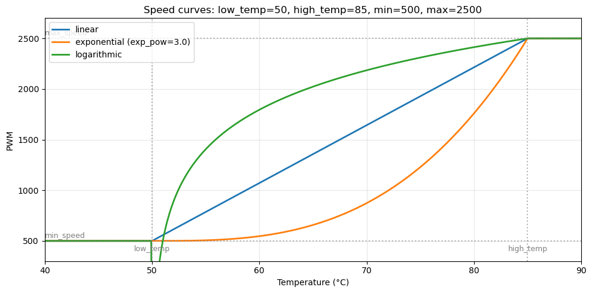
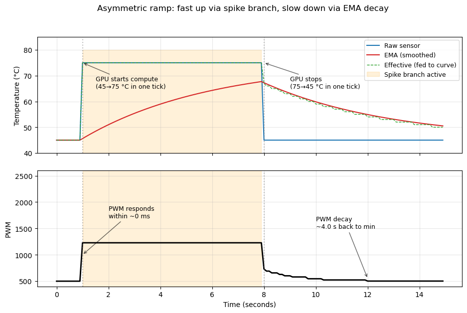

# Control loop in t2fanrd

This document explains how the fan control algorithm in `t2fanrd` works — how raw sensor readings turn into PWM writes, why the response is asymmetric (fast on a heat spike, slow on a cooldown), and how often the daemon reads and writes sysfs.

All numbers and traces below use the reference slot 1 fan from `systemd/t2fand.conf`:

```ini
[Fan2]
auto=false
low_temp=50
high_temp=85
speed_curve=exponential
exp_pow=3.0
sensors=slot:1
```

with `min_speed=500`, `max_speed=2500` read from sysfs.

## Pipeline overview

Each tick of `start_temp_loop` in `src/main.rs` runs every tracked fan's reading through five stages:

```
                       per-tick, per-fan
  ┌─────────────┐    ┌──────────────┐    ┌────────────────┐    ┌────────────┐    ┌─────────────┐
  │  Stage 1:   │    │  Stage 2:    │    │  Stage 3:      │    │  Stage 4:  │    │  Stage 5:   │
  │  Sensor     │──> │  EMA         │──> │  Asymmetric    │──> │  Speed     │──> │  PWM        │──> set_speed
  │  pool read  │    │  smoothing   │    │  ramp decision │    │  curve     │    │  hysteresis │
  └─────────────┘    └──────────────┘    └────────────────┘    └────────────┘    └─────────────┘
                                                                                         │
                                                                                         ▼
                                                                                  write to sysfs?
```

Stages 1–5 are pure functions of state + input. Only stage 5 decides whether to actually `write()` to the fan's `fanN_target` file (the macsmc RPM setpoint; the daemon writes an RPM in `[min, max]`, which makes macsmc engage manual mode for that fan). "PWM" below is used loosely for that setpoint value.

## Stage 1 — Sensor pool read

`SensorPool::read_all` (`src/fan_controller.rs:42`) reads every unique sensor exactly once per tick into a `SensorReadings` struct:

```rust
struct SensorReadings {
    cpu: Option<u8>,        // None if no fan uses `sensors=cpu`
    hwmons: Vec<u8>,        // parallel to SensorPool::hwmons
}
```

Each entry is a single `pread(fd, buf, 0)` syscall reading from offset 0 — no `read + lseek` pair. The daemon-level pool is the same set of file handles regardless of how many fans reference each sensor: two fans both listing `sensors=slot:1` would share the same two hwmon `File`s in the pool and the read happens once per tick.

Each fan's `compute_max_temp(&readings)` (`src/fan_controller.rs:128`) then looks up its sensors by index and returns the max.

## Stage 2 — EMA smoothing

Per-fan state is one `Option<f32>` (`FanTempTracker.ema` in `src/main.rs:302`). Each tick:

```
ema_new  =  α · sample  +  (1 − α) · ema_old
```

`α` is picked from one of two constants depending on the **previous** tick's sleep duration:

| Sleep before this tick | α used | Time constant (wall clock) |
|---|---|---|
| 100 ms (short) | `ALPHA_SHORT = 0.02` | ≈ 5 s |
| 1 s (long) | `ALPHA_LONG = 0.18` | ≈ 5 s |

The two α values are matched so the EMA's effective time constant is the same ~5 seconds in wall-clock terms regardless of which cadence the daemon is in. (Math: `α ≈ 1 − exp(−Δt/τ)` for `τ = 5 s`.)

On the first iteration, `ema` is `None`; the daemon initializes it to the first sample (no warm-up artifact).

The EMA value is **symmetric** by itself — it tracks toward the target at the same rate whether the target is higher or lower. The asymmetric behavior comes from the next stage.

## Stage 3 — Asymmetric ramp decision

```rust
let prev_ema_int = tracker.ema.map_or(fan_temp, |v| v as u8);
let effective_temp = if fan_temp > prev_ema_int.saturating_add(SPIKE_THRESHOLD_C) {
    fan_temp              // spike branch: raw sample drives the curve
} else {
    new_ema as u8         // normal branch: smoothed value drives the curve
};
```

with `SPIKE_THRESHOLD_C = 5`. The check is one-sided: it only fires when the raw sample is at least 5 °C **above** the previous EMA. A falling raw sample (any magnitude) cannot satisfy `raw > prev_ema + 5`, so drops always take the EMA path.

| Situation | Spike check | `effective_temp` | Behavior |
|---|---|---|---|
| Steady-state | false | EMA | quiet |
| Mild drift up (1–3 °C) | false | EMA | slow ramp up |
| **Sharp rise (≥5 °C)** | **true** | **raw sample** | **fast ramp up (1 tick)** |
| Mild drift down | false | EMA | slow ramp down |
| **Sharp drop** | false | EMA (decaying slowly) | **slow ramp down** |

## Stage 4 — Speed curve

The curve (`FanController::calc_speed` in `src/fan_controller.rs:171`) maps `effective_temp` to PWM. It's a **stateless** function — same temperature in, same PWM out. The shape depends on `speed_curve`:



For the reference slot 1 fan (`low_temp=50, high_temp=85, exp_pow=3.0`):

| `effective_temp` | linear | exponential (exp_pow=3.0) | logarithmic |
|---|---|---|---|
| ≤ 50 | 500 | 500 | 500 |
| 60 | 1071 | 547 | 1490 |
| 65 | 1357 | 678 | 1696 |
| 70 | 1643 | 873 | 1853 |
| 75 | 1929 | 1228 | 1973 |
| 80 | 2214 | 1741 | 2090 |
| ≥ 85 | 2500 | 2500 | 2500 |

With `exp_pow=3.0` the fan is quiet through the lower 2/3 of the temperature range, then ramps aggressively near `high_temp`. That composes naturally with the asymmetric ramp: idle-to-spike produces a big PWM jump via the steep upper region.

## Stage 5 — PWM hysteresis (deadband)

```rust
let pwm_threshold = ((fan.max_speed() - fan.min_speed()) / 100).max(5);
if new_pwm.abs_diff(tracker.last_pwm) >= pwm_threshold {
    fan.set_speed(new_pwm)?;
    tracker.last_pwm = new_pwm;
}
```

For the slot 1 fan: `(2500 − 500) / 100 = 20` PWM units. The daemon writes only if the new PWM differs from the last one written by at least 20. This eliminates micro-thrash when temperatures hover at a boundary (the integer EMA can shift by 1 from tick to tick without the curve output meaningfully changing).

The spike branch's large temperature jumps always produce PWM deltas well above the threshold, so spike responses always write.

## Putting it together: a workload trace

The plot below simulates the full pipeline against the reference slot 1 fan during a 7-second GPU compute burst:



What's happening at each phase:

| Time | Event | Algorithm behavior |
|---|---|---|
| 0 – 1 s | idle at 45 °C | EMA settled at 45, PWM = `min_speed` (500), no writes |
| **t = 1 s** | **GPU compute starts, raw → 75 °C** | Spike check fires (75 > 45+5). `effective_temp = 75`. PWM jumps from 500 to 1228 **within one 100 ms tick**. |
| 1 – 8 s | sustained 75 °C | EMA gradually rises from 45 toward 75 (takes >5 s to get within 5 °C). Spike check stays true throughout because EMA never catches up. PWM tracks `calc_speed(75) = 1228`. |
| **t = 8 s** | **GPU stops, raw → 45 °C** | Drop is **not** a spike (raw < prev_ema). `effective_temp = EMA`. EMA was ≈ 68 at this moment. |
| 8 – 12 s | EMA decay | EMA decays from 68 → 45 with ~5 s time constant. PWM follows the curve down: 1228 → 727 → 691 → … → 500. Step changes happen each time the curve output crosses the hysteresis threshold. |
| 12 s onward | EMA ≈ 45 | PWM stable at 500 (`min_speed`), no more writes |

The orange shaded region marks where the spike branch was active. Notice it covers the entire load duration — for sustained heat, the spike branch keeps the fan responsive to the raw value the whole time.

## How often does the daemon read / write?

### Reads — sensor pool

The pool reads every unique sensor exactly once per tick. For the reference Mac Pro 2019 config:

- 1 × CPU `temp1_input` (used by `Fan4`)
- 2 × slot:1 GPU dies (`hwmon14`, `hwmon15`, used by `Fan2`)
- 2 × slot:3 GPU dies (`hwmon16`, `hwmon17`, used by `Fan3`)

= **5 sensor reads per tick**, each a single `pread()` syscall (no `lseek`).

| Sleep cadence | Wall-clock rate | Reads / sec |
|---|---|---|
| Short (100 ms) — daemon is actively writing PWM | 10 Hz | 50 reads/sec |
| Long (1 s) — daemon stable, no PWM changes | 1 Hz | 5 reads/sec |

`Fan1` is `auto=true` so the daemon doesn't track it. No reads attributed to it.

If multiple fans listed the same sensor (e.g. both `Fan2` and a hypothetical extra fan with `sensors=slot:1`), the pool would still only have 2 entries for slot:1 and the read count would stay at 5/tick. Dedup is automatic in `build_sensor_setup` (`src/main.rs:235`).

### Writes — PWM output

A write happens for fan *N* on any tick where `|new_pwm − last_pwm[N]| ≥ pwm_threshold[N]`. Per-fan, per tick: 0 or 1 write.

| Phase | Typical writes / sec |
|---|---|
| True steady state (temperature flat) | 0 |
| Borderline-temperature noise (EMA jitter without spike) | 0 (hysteresis blocks small deltas) |
| Mild drift (1–3 °C/sec) | a few writes / sec per fan in motion |
| Sharp spike or sustained heat (raw drives curve) | up to 10 / sec per fan during the active phase |
| EMA decay back to idle | a few writes / sec per fan, stepping down by the hysteresis threshold |

For your reference workload (idle → 7 s burst at 75 °C → idle): about **30 writes total across the whole event** for the slot 1 fan — one big jump at spike start, ~20 small steps during decay, then quiet.

### Sleep cadence

After each per-fan pass, the daemon picks one of two sleeps:

```rust
if any_changed {  // any fan wrote PWM this tick
    sleep(100 ms); was_long_sleep = false;
} else {
    sleep(1 s);   was_long_sleep = true;
}
```

So:
- **Short sleep (100 ms)** whenever at least one tracked fan wrote PWM in the current tick. The next tick uses `ALPHA_SHORT`.
- **Long sleep (1 s)** whenever no fan wrote. The next tick uses `ALPHA_LONG`.

In steady state (no temperature change, no PWM writes), the daemon settles into 1 Hz polling. As soon as any fan crosses the hysteresis threshold, the loop switches to 10 Hz for fast response and stays there as long as something is changing.

### Total syscall budget

Per tick the daemon makes:

- 5 × `pread` (sensor reads, one per unique sensor)
- 0–3 × `write` (one per tracked fan whose PWM crossed the hysteresis threshold this tick)
- 1 × `nanosleep` (either 100 ms or 1 s)

In steady state at 1 Hz: **~6 syscalls / second**, ~6 μs of CPU time / second → ~0.0006% of one core.

During an active transient at 10 Hz: **~60–80 syscalls / second**, ~80 μs / second → ~0.008% of one core.

CPU usage is invisible on any practical profile. The control loop is overwhelmingly bounded by `nanosleep` waiting.

## Summary: why "fast up, slow down"

Three properties combine to produce the asymmetric behavior:

1. **EMA is symmetric.** By itself, the EMA would produce equal time constants for rises and falls.
2. **Asymmetric ramp is one-sided.** The check `raw > prev_ema + 5` only fires for rising temperatures of ≥ 5 °C. It never fires for falling temps, regardless of magnitude. When it fires, the raw sample bypasses the EMA and goes straight to the curve.
3. **Hysteresis lets big deltas through.** A spike-driven PWM jump (typically 300+ PWM units) sails past the 20-unit threshold; small EMA-driven steps may be filtered out individually but accumulate to drive PWM down over the decay window.

Net result for sharp transitions:

- **Rising edge ≥ 5 °C** → spike branch picks raw → curve → big PWM jump → hysteresis writes → fan ramps **within one tick (≤ 100 ms)**.
- **Falling edge (any magnitude)** → spike branch dormant → EMA decays slowly → curve follows EMA → small PWM steps stitched through hysteresis → fan ramps down over the **~5 s EMA time constant**.
- **Mild drift either direction** → both go through EMA → symmetric, slow.

Which matches the design goal: react fast to real heat, settle quiet under cooldown.
